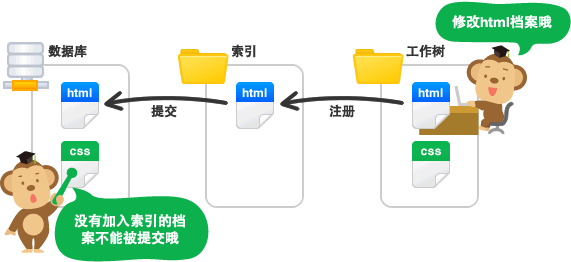

# 介绍 About

## Git 是什么？
> 目前世界上使用最广泛的分布式版本控制系统

## SVN 与 Git 最主要的区别
* SVN是 `集中式的版本控制系统`，版本库是集中放在中央服务器的，而干活的时候，用的都是自己的电脑，所以首先要从中央服务器哪里得到最新的版本，然后干活，干完后，需要把自己做完的活推送到中央服务器。集中式版本控制系统是必须联网才能工作，如果在局域网还可以，带宽够大，速度够快，如果在互联网下，如果网速慢的话，就会影响工作。

* Git是 `分布式版本控制系统`，那么它就没有中央服务器的，每个人的电脑就是一个完整的版本库，这样，工作的时候就不需要联网了，因为版本都是在自己的电脑上。既然每个人的电脑都有一个完整的版本库，那多个人如何协作呢？比如说自己在电脑上改了文件A，其他人也在电脑上改了文件A，这时，你们两之间只需把各自的修改推送给对方，就可以互相看到对方的修改了。

## Git 三大区

* 工作区、暂存区、版本库

## 三种文件特殊状态

* 未跟踪的：untracked
* 未暂存的：unstaged
* 未提交的：uncommited
