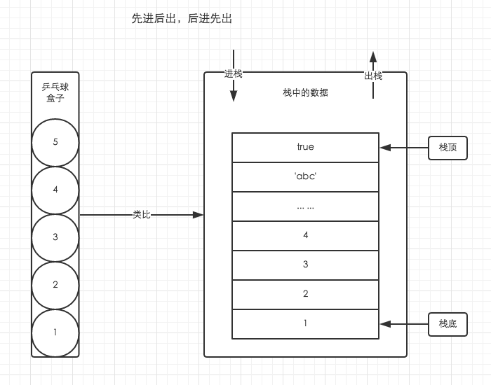
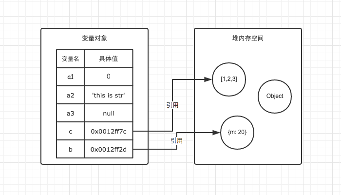
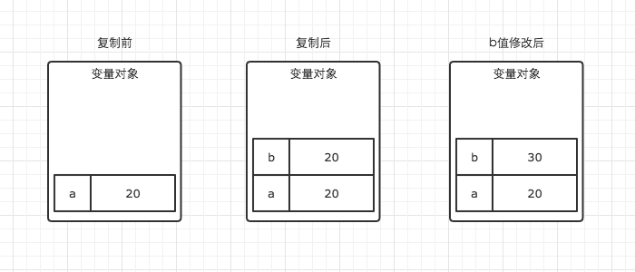
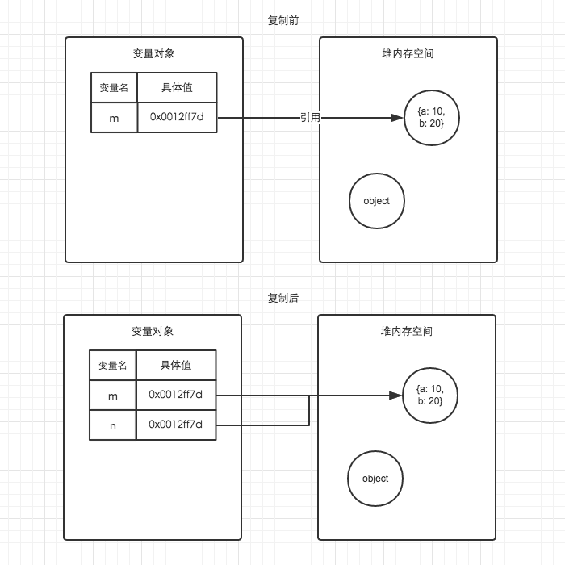

# Theory 内存空间

```javascript
// demo01.js
var a = 20;
var b = a;
b = 30;

// 这时a的值是多少？
```

```javascript
// demo02.js
var m = { a: 10, b: 20 }
var n = m;
n.a = 15;

// 这时m.a的值是多少
```

### 1 栈与堆

与C/C++不同，JavaScript中并没有严格意义上区分栈内存与堆内存。因此我们可以粗浅的理解为JavaScript的所有数据都保存在堆内存中。但是在某些场景，我们仍然需要基于堆栈数据结构的思路进行处理，比如JavaScript的执行上下文。执行上下文在逻辑上实现了堆栈。因此理解堆栈数据结构的原理与特点仍然十分重要。

要简单理解栈的存取方式，我们可以通过类比乒乓球盒子来分析。如下图左侧。



这种乒乓球的存放方式与栈中存取数据的方式如出一辙。处于盒子中最顶层的乒乓球5，它一定是最后被放进去，但可以最先被使用。而我们想要使用底层的乒乓球1，就必须将上面的4个乒乓球取出来，让乒乓球1处于盒子顶层。这就是栈空间先进后出，后进先出的特点。图中已经详细的表明了栈空间的存储原理。

堆存取数据的方式，则与书架与书非常相似。

书虽然也整齐的存放在书架上，但是我们只要知道书的名字，我们就可以很方便的取出我们想要的书，而不用像从乒乓球盒子里取乒乓一样，非得将上面的所有乒乓球拿出来才能取到中间的某一个乒乓球。好比在JSON格式的数据中，我们存储的key-value是可以无序的，因为顺序的不同并不影响我们的使用，我们只需要关心书的名字。

### 2 基础数据类型

JavaScript的执行上下文生成之后，会创建一个叫做变量对象的特殊对象（执行上下文与变量对象后面介绍），JavaScript的基础数据类型往往会直接把值保存在变量对象中。

> 严格意义上来说，变量对象也是存放于堆内存中，但是由于变量对象的特殊职能，我们在理解时仍然需要将其于堆内存区分开来。

基础数据类型都是一些简单的数据段，JavaScript中有5中基础数据类型，分别是`Undefined` `Null` `Boolean` `Number` `String`。基础数据类型都是按值访问，因为我们可以直接操作保存在变量中的实际的值。

### 3 引用数据类型

与其他语言不通，JS的引用数据类型，比如数组Array，它们值的大小是不固定的。引用数据类型的值是保存在堆内存中的对象。JavaScript不允许直接访问堆内存中的位置，因此我们不能直接操作对象的堆内存空间。在操作对象时，实际上是在操作对象的引用而不是实际的对象。因此，引用类型的值都是按引用访问的。这里的引用，我们可以粗浅地理解为保存在变量对象中的一个地址，该地址与堆内存的实际值相关联。

为了更好的搞懂变量对象与堆内存，我们可以结合以下例子与图解进行理解。

```javascript
var a1 = 0;   // 变量对象
var a2 = 'this is string'; // 变量对象
var a3 = null; // 变量对象

var b = { m: 20 }; // 变量b存在于变量对象中，{m: 20} 作为对象存在于堆内存中
var c = [1, 2, 3]; // 变量c存在于变量对象中，[1, 2, 3] 作为对象存在于堆内存中
```



因此当我们要访问堆内存中的引用数据类型时，实际上我们首先是从变量对象中获取了该对象的地址引用（或者地址指针），然后再从堆内存中取得我们需要的数据。

理解了JS的内存空间，我们就可以借助内存空间的特性来验证一下引用类型的一些特点了。

### 4 示例回顾

```javascript
// demo01.js
var a = 20;
var b = a;
b = 30;

// 这时a的值是多少？
```

```javascript
// demo02.js
var m = { a: 10, b: 20 }
var n = m;
n.a = 15;

// 这时m.a的值是多少
```

在变量对象中的数据发生复制行为时，系统会自动为新的变量分配一个新值。在demo01中，var b = a执行之后，a与b虽然值都等于20，但是他们其实已经是相互独立互不影响的值了。具体如图。所以我们修改了b的值以后，a的值并不会发生变化。



在demo02中，我们通过var n = m执行一次复制引用类型的操作。引用类型的复制同样也会为新的变量自动分配一个新的值保存在变量对象中，但不同的是，这个新的值，仅仅只是引用类型的一个地址指针。当地址指针相同时，尽管他们相互独立，但是在变量对象中访问到的具体对象实际上是同一个。如图所示。

因此当我改变n时，m也发生了变化。这就是引用类型的特性。


