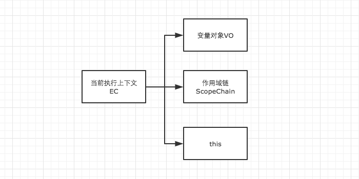

# Theory 变量对象

```javascript
// demo01
function test() {
    console.log(a);
    console.log(foo());

    var a = 1;
    function foo() {
        return 2;
    }
}

test();
```

```javascript
// demo2
function test() {
    console.log(foo);
    console.log(bar);

    var foo = 'Hello';
    console.log(foo);
    var bar = function () {
        return 'world';
    }

    function foo() {
        return 'hello';
    }
}

test();
```

### 1 执行上下文的生命周期

当调用一个函数时（激活），一个新的执行上下文就会被创建，而一个执行上下文的生命周期可以分为两个阶段：

* 创建阶段：在这个阶段中，执行上下文会分别创建变量对象，建立作用域链，以及确定this的指向

* 代码执行阶段：创建完成之后，就会开始执行代码，这个时候，会完成变量赋值，函数引用，以及执行其他代码。


从这里我们就可以看出详细了解执行上下文极为重要，因为其中涉及到了变量对象，作用域链，this等很多人没有怎么弄明白，但是却极为重要的概念，因此它关系到我们能不能真正理解JavaScript。



### 2 变量对象（Variable Object）

变量对象的创建，依次经历了以下几个过程。

* 建立arguments对象。检查当前上下文中的参数，建立该对象下的属性与属性值。

* 检查当前上下文的函数声明，也就是使用function关键字声明的函数。在变量对象中以函数名建立一个属性，属性值为指向该函数所在内存地址的引用。如果函数名的属性已经存在，那么该属性将会被新的引用所覆盖。

* 检查当前上下文中的变量声明，每找到一个变量声明，就在变量对象中以变量名建立一个属性，属性值为undefined。如果该变量名的属性已经存在，为了防止同名的函数被修改为undefined，则会直接跳过，原属性值不会被修改。


在上面的规则中我们看出，function声明会比var声明优先级更高一点。

### 3 全局上下文的变量对象

以浏览器中为例，全局对象为window。

全局上下文有一个特殊的地方，它的变量对象，就是window对象。而这个特殊，在this指向上也同样适用，this也是指向window。

```javascript
// 以浏览器中为例，全局对象为window
// 全局上下文
windowEC = {
    VO: window,
    scopeChain: {},
    this: window
}
```

除此之外，全局上下文的生命周期，与程序的生命周期一致，只要程序运行不结束，比如关掉浏览器窗口，全局上下文就会一直存在。其他所有的上下文环境，都能直接访问全局上下文的属性。

### 4 示例回顾

```javascript
// demo01
function test() {
    console.log(a);
    console.log(foo());

    var a = 1;
    function foo() {
        return 2;
    }
}

test();
```

在上例中，我们直接从test()的执行上下文开始理解。全局作用域中运行test()时，test()的执行上下文开始创建。为了便于理解，我们用如下的形式来表示

```javascript
// 创建过程
testEC = {
    // 变量对象
    VO: {},
    scopeChain: {},
    this: {}
}

// 因为本文暂时不详细解释作用域链和this，所以把变量对象专门提出来说明

// VO 为 Variable Object 的缩写，即变量对象
VO = {
    arguments: {...},  //注：在浏览器的展示中，函数的参数可能并不是放在arguments对象中，这里为了方便理解，我做了这样的处理
    foo: <foo reference>  // 表示foo的地址引用
    a: undefined
}
```

未进入执行阶段之前，变量对象中的属性都不能访问！但是进入执行阶段之后，变量对象转变为了活动对象，里面的属性都能被访问了，然后开始进行执行阶段的操作。

```javascript
// 执行阶段
VO ->  AO // Active Object
AO = {
    arguments: {...},
    foo: <foo reference>,
    a: 1
}
```

因此，上面的例子demo1，执行顺序就变成了这样

```javascript
function test() {
    function foo() {
        return 2;
    }
    var a;
    console.log(a);
    console.log(foo());
    a = 1;
}

test();
```

再来看另一个例子，巩固一下我们的理解。

```javascript
// demo2
function test() {
    console.log(foo);
    console.log(bar);

    var foo = 'Hello';
    console.log(foo);
    var bar = function () {
        return 'world';
    }

    function foo() {
        return 'hello';
    }
}

test();
```

```javascript
// 创建阶段
VO = {
    arguments: {...},
    foo: <foo reference>,
    bar: undefined
}
// 这里有一个需要注意的地方，因为var声明的变量当遇到同名的属性时，会跳过而不会覆盖
```

```javascript
// 执行阶段
VO -> AO
VO = {
    arguments: {...},
    foo: 'Hello',
    bar: <bar reference>
}
```
