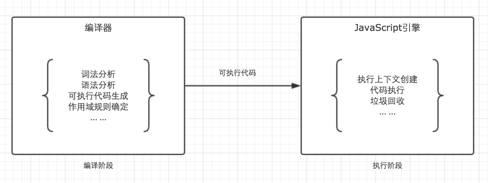
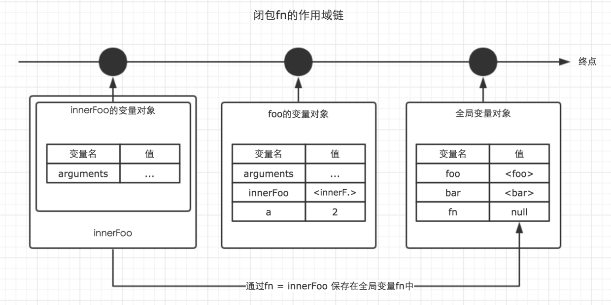

# Theory 作用域链

```javascript
var fn = null;
function foo() {
    var a = 2;
    function innerFoo() { 
        console.log(a);
    }
    fn = innerFoo;
}

function bar() {
    fn();
}

foo(); // 输出什么
bar(); // 输出什么
```

### 1 作用域

* 在JavaScript中，我们可以将作用域定义为一套规则,这套规则用来管理引擎如何在当前作用域以及嵌套的子作用域中根据标识符名称（这里的标识符，指的是变量名或者函数名）进行变量查找。
* JavaScript在ES6之前，只有全局作用域与函数作用域（因为eval我们平时开发中几乎不会用到它，这里不讨论）。
* 作用域与执行上下文是完全不同的两个概念。

> JavaScript代码的整个执行过程，分为两个阶段，代码编译阶段与代码执行阶段。编译阶段由编译器完成，将代码翻译成可执行代码，这个阶段作用域规则会确定。执行阶段由引擎完成，主要任务是执行可执行代码，执行上下文在这个阶段创建。



### 2 作用域链

回顾一下之前我们分析的执行上下文的生命周期，如下图


我们发现，作用域链是在执行上下文的创建阶段生成的。这个就奇怪了。上面我们刚刚说作用域在编译阶段确定规则，可是为什么作用域链却在执行阶段确定呢？

我们上面说了，作用域是一套规则，那么作用域链是什么呢？是这套规则的具体实现。所以这就是作用域与作用域链的关系。

函数在调用激活时，会开始创建对应的执行上下文，在执行上下文生成的过程中，变量对象，作用域链，以及this的值会分别被确定。

作用域链，是由当前环境与上层环境的一系列变量对象组成，它保证了当前执行环境对符合访问权限的变量和函数的有序访问。

为了帮助大家理解作用域链，我我们先结合一个例子，以及相应的图示来说明。

```javascript
var a = 20;

function test() {
    var b = a + 10;

    function innerTest() {
        var c = 10;
        return b + c;
    }

    return innerTest();
}

test();
```

在上面的例子中，全局，函数test，函数innerTest的执行上下文先后创建。我们设定他们的变量对象分别为VO(global)，VO(test), VO(innerTest)。而innerTest的作用域链，则同时包含了这三个变量对象，所以innerTest的执行上下文可如下表示。

```javascript
innerTestEC = {
    VO: {...},  // 变量对象
    scopeChain: [VO(innerTest), VO(test), VO(global)], // 作用域链
    this: {}
}
```

我们可以直接用一个数组来表示作用域链，数组的第一项scopeChain[0]为作用域链的最前端，而数组的最后一项，为作用域链的最末端，所有的最末端都为全局变量对象。如图。


> 注意，因为变量对象在执行上下文进入执行阶段时，就变成了活动对象，因此图中使用了AO来表示。Active Object

因此，我们可以看到，作用域链其实是由一系列变量对象组成，我们可以在这个单向通道中，查询变量对象中的标识符，这样就可以访问到上一层作用域中的变量了。

### 3 闭包

理解了作用域链，才能真正理解闭包的概念。

先直截了当的抛出闭包的定义：当函数可以记住并访问所在的作用域（全局作用域除外）时，就产生了闭包，即使函数是在当前作用域之外执行。

> 简单来说，假设函数A在函数B的内部进行定义了，并且当函数A在执行时，访问了函数B内部的变量对象，那么B就是一个闭包。

JavaScript拥有自动的垃圾回收机制，关于垃圾回收机制，有一个重要的行为，那就是，当一个值，在内存中失去引用时，垃圾回收机制会根据特殊的算法找到它，并将其回收，释放内存。

而我们知道，函数的执行上下文，在执行完毕之后，生命周期结束，那么该函数的执行上下文就会失去引用。其占用的内存空间很快就会被垃圾回收器释放。可是闭包的存在，会阻止这一过程。

### 4 示例回顾

```javascript
var fn = null;
function foo() {
    var a = 2;
    function innerFoo() { 
        console.log(a);
    }
    fn = innerFoo; // 将 innerFoo的引用，赋值给全局变量中的fn
}

function bar() {
    fn(); // 此处的保留的innerFoo的引用
}

foo();
bar(); // 2
```

在上面的例子中，foo()执行完毕之后，按照常理，其执行环境生命周期会结束，所占内存被垃圾收集器释放。但是通过fn = innerFoo，函数innerFoo的引用被保留了下来，复制给了全局变量fn。这个行为，导致了foo的变量对象，也被保留了下来。于是，函数fn在函数bar内部执行时，依然可以访问这个被保留下来的变量对象。所以此刻仍然能够访问到变量a的值。

这样，我们就可以称foo为闭包。

下图展示了闭包foo的作用域链。



所以，通过闭包，我们可以在其他的执行上下文中，访问到函数的内部变量。比如在上面的例子中，我们在函数bar的执行环境中访问到了函数foo的a变量。

虽然例子中的闭包被保存在了全局变量中，但是闭包的作用域链并不会发生任何改变。在闭包中，能访问到的变量，仍然是作用域链上能够查询到的变量。
